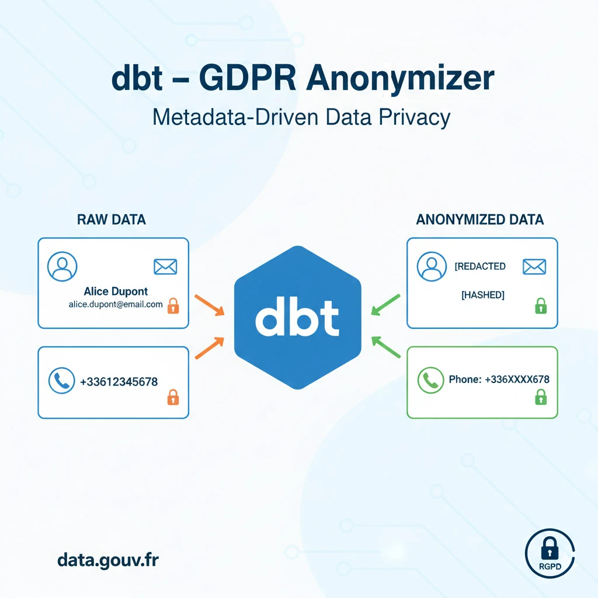

# Dbt GDPR Anonymizer

[](https://www.python.org/)
[](https://www.getdbt.com/)
[](https://duckdb.org/)
[](https://github.com/astral-sh/uv)

[](https://gdpr-info.eu/)
[](https://github.com/ton-repo)
[](https://opensource.org/licenses/MIT)




---

A professional-grade implementation of programmatic data anonymization using dbt's meta properties and Jinja macros. This project demonstrates how to decouple security logic from transformation logic using real-world French Government data (RNE).

---

## 🚩 Problem Statement

The GDPR Compliance Challenge

Under the General Data Protection Regulation (GDPR), organizations handling European citizens' data are legally bound to implement "Privacy by Design" and "Privacy by Default". In a modern data stack, this means PII (Personally Identifiable Information) must be protected as soon as it enters the Data Warehouse.

However, most data teams face a "Compliance Gap":

- Manual Intervention: Data Engineers often rely on manual SQL masking, which is prone to human error and oversight.

- Inconsistent Policies: Security rules are often scattered across different BI tools or dbt models, making it impossible for a Data Privacy Officer (DPO) to certify the pipeline.

The Cost of Non-Compliance

Failing to automate and audit PII protection isn't just a technical debt, it's a major business risk:

- Financial Penalties: Under GDPR, companies can be fined up to €20 million or 4% of their global annual turnover (whichever is higher).

- Reputational Damage: Data leaks involving elected officials (like the RNE dataset used here) lead to a total loss of public trust and legal scrutiny.

- The "Leak by Default" Syndrome: Without a programmatic approach, every new column added to a source is a potential PII leak until someone manually decides to mask it.


### ⚠️ Operational Bottlenecks

Beyond legal risks, traditional manual anonymization creates significant technical debt:

- **Logic Pollution:** SQL models become cluttered with repetitive CASE WHEN, HASH(), or LEFT(phone, 3) functions. This "boilerplate" code obscures the actual business logic, making models harder to read, maintain, and debug.

- **Documentation Drift:** In most setups, the data dictionary (schema.yml) and the actual SQL logic are decoupled. If a developer updates the masking logic in SQL but forgets to update the YAML documentation, the "Source of Truth" is broken. This leads to a false sense of security.

- **Scalability & Audit Issues:** Hard-coding masking rules at the model level makes it impossible for Data Privacy Officers (DPO) to audit the pipeline. A DPO cannot be expected to review thousands of lines of SQL; they need a high-level, declarative view of how data is handled.

- **Maintenance Nightmare:** If the hashing algorithm needs to change (e.g., switching from MD5 to SHA256), a manual approach requires updating every single model file. A metadata-driven approach requires updating exactly one macro.

---

## 🎯 Project Objective

The goal is to build a Zero-Touch Anonymization pipeline where the privacy policy is defined solely in the schema.yml metadata. The system must:

- Automatically detect sensitive columns via meta tags.

- Apply context-aware masking (Hashing, Redaction, or Partial Masking).

- Ensure 100% auditability through a single configuration file.

---

## 💡 Proposed Solution

This project implements Metadata-Driven Masking. Instead of writing privacy logic in .sql files, we use dbt's meta key as a Control Plane.
Technical Architecture

- **Source Control:** French National Directory of Elected Officials (RNE) — real-world PII data.

- **Security Macro:** A centralized Jinja macro (mask_pii) that inspects the dbt graph at compilation time to apply the correct transformation.

- **Infrastructure:** Containerized environment using Docker and managed by uv for ultra-fast dependency resolution.

---

## 🔐 Anonymization Strategy

This project implements a metadata‑driven anonymization pipeline using dbt’s meta properties.
All privacy rules are defined declaratively in schema.yml, and applied automatically at compile time through a centralized macro.

### Key Principles

- **Privacy by Design:** PII is anonymized as soon as it enters the warehouse.

- **Zero‑Touch Masking:** No masking logic is written manually in SQL models.

- **Single Source of Truth:** All rules live in metadata, not in SQL.

- **Auditability:** A DPO can review the entire privacy policy in one file.

### Masking Techniques

Depending on the metadata attached to each column, the macro applies:

| **Tag**              | **Technique**                     | **Example** |
|----------------------|-----------------------------------|-------------|
| `pii: email`         | Redaction + domain replacement    | `john.doe@mairie.fr` → `xxxxxx@anonymized.gouv.fr` |
| `pii: phone`         | Partial masking                   | `06 12 34 56 78` → `06 XX XX XX XX` |
| `pii: coordinates`   | Noise injection (3-decimal rounding) | `48.8566, 2.3522` → `48.857, 2.352` |
| `pii: hash`          | SHA‑256 hashing                   | Deterministic pseudonymization |

This ensures consistency, auditability, and future‑proofing (changing the algorithm requires editing only one macro).

---

## 🔎 K‑Anonymity Validation & CNIL Justification

To ensure that anonymized data cannot be re‑identified through indirect attributes, the project implements a K‑anonymity validation step in Python.

### Why Geographic K‑Anonymity Is Impossible

The dataset contains many services located in departments with 1 or 2 entries only.
This makes geographic K‑anonymity mathematically impossible, even for K=2.

This is consistent with CNIL guidance:

> When the density of a dataset is too low, geographic K‑anonymity is  not applicable.
> A different quasi‑identifier must be used.

### Organizational K‑Anonymity

Instead of geography, K‑anonymity is applied to organizational attributes, which are the real discriminants of the dataset:

- <code>service_name</code>
- <code>parent_organization</code>
- <code>organization_type</code>

However, some categories are too fine‑grained (e.g., "association d’utilité publique", "service déconcentré").
Following CNIL recommendations, these categories were aggregated into a new field: <code>organization_category</code>


---

## 📁 Project Structure

```
.
├── dbt_project/                     # Main dbt project (models, macros, seeds, tests)
│   ├── analyses/                    # Optional dbt analyses
│   ├── dbt_packages/                # Installed dbt packages (dbt_utils, dbt_expectations, etc.)
│   ├── macros/                      # Custom macros, including the masking engine
│   ├── models/                      # Core transformation logic
│   │   ├── staging/                 # Source standardization (stg_*)
│   │   ├── intermediate/            # Business logic + anonymization checks
│   │   └── marts/                   # Final curated models (if needed)
│   ├── seeds/                       # Static CSV inputs (e.g., lookup tables)
│   ├── snapshots/                   # Historical snapshots (optional)
│   ├── target/                      # dbt compiled & run artifacts
│   └── tests/                       # Custom tests and schema tests
│
└── src/                             # Python package for validation & utilities
    ├── dbt_gdpr_anonymizer/
    │   ├── config/                  # Python configuration (env, settings)
    │   └── scripts/                 # Python scripts (download, validation, K-anonymity)
    └── dbt_gdpr_anonymizer.egg-info # Package metadata

```
---

## 🚀 Getting Started

### ⚙️ Prerequisites

- Python 3.12+
- uv or virtualenv
- Docker & Docker Compose (optional)

### 🖥️ Setup

#### Using uv

Installing uv (if necessary):

```bash
curl -LsSf https://astral.sh/uv/install.sh | sh
```

Create a virtual environment and install dependencies:

```bash
uv venv
```

Activate the virtual environment:

On Linux and macOS:

```bash
source .venv/bin/activate
```

On Windows:

```bash
.venv\Scripts\activate
```

Install dependencies:

```bash
uv pip install -r pyproject.toml
```

### 🖥️ Setup & Execution

Follow these steps to install dependencies, configure the environment, download the dataset, run dbt transformations, and validate GDPR compliance.

---

### 1. Create and configure the environment file

```bash
cp env.example .env
```

Edit `.env` to set your database credentials and environment variables.

---

### 2. Generate a secure salt for dbt hashing

```bash
python -c "import secrets; print(secrets.token_urlsafe(64))"
```

Copy the generated value into your `.env` under:

```
DBT_SALT=your_generated_salt
```

---

### 3. Install Python dependencies using uv

```bash
uv sync
```

---

### 4. Install dbt packages

```bash
uv run dbt deps
```

---

### 5. Download the source dataset (RNE)

```bash
uv run python src/dbt_gdpr_anonymizer/scripts/download_data.py
```

This script fetches the French RNE dataset and stores it in `data/`.

---

### 6. Load seeds into the warehouse

```bash
uv run dbt seed
```

---

### 7. Run dbt transformations (including anonymization)

```bash
uv run dbt run
```

This step:

- applies metadata‑driven masking  
- generates anonymized tables  
- computes organizational categories  
- performs quality checks  

---

### 8. Validate GDPR compliance (K‑anonymity, masking quality)

```bash
uv run python src/dbt_gdpr_anonymizer/scripts/validate_anonymization.py
```

This script checks:

- email anonymization  
- phone anonymization  
- coordinate validity  
- K‑anonymity on organizational categories  

---

### 9. Generate a PII Exposure Report (optional)

```bash
uv run python src/dbt_gdpr_anonymizer/scripts/export_pii_report.py
```

This produces a human‑readable summary of:

- detected PII columns  
- masking techniques applied  
- remaining risks  
- compliance status  

---

Your anonymized dataset is now ready for analysis or publication.


## ✨ Contributing

1. Fork the repository
2. Create a new branch (`git checkout -b feature/your-feature`)
3. Make your changes
4. Commit your changes (`git commit -am 'Add some feature'`)
5. Push to the branch (`git push origin feature/your-feature`)
6. Create a new Pull Request

---


## 📄 License

This project is under the **MIT License**. See [LICENSE](LICENSE) for more details.

---

## 📚 References

- [RGPD - CNIL](https://www.cnil.fr/fr/reglement-europeen-protection-donnees)
- [dbt Documentation](https://docs.getdbt.com/)
- [K-anonymity Paper](https://dataprivacylab.org/dataprivacy/projects/kanonymity/)
- [Data.gouv.fr API](https://www.data.gouv.fr/fr/apidoc/)


---

## 👤 Author

**Jean-Michel LIEVIN**  
Data & IA Enthusiast | Full Stack Senior (10+ years)

- 🌐 Portfolio: [github.com/tabodino](https://github.com/tabodino)
- 💼 LinkedIn: [linkedin.com/in/jean-michel-lievin](https://www.linkedin.com/in/jean-michel-lievin)
- 📧 Email: [jeanmichel.liev1@gmail.com](mailto:jeanmichel.liev1@gmail.com)

---

## 🛠️ Support

For issues and questions, open an issue on GitHub.

[](mailto:jeanmichel.liev1@gmail.com)
[](https://github.com/tabodino/dbt-gdpr-anonymizer/issues)